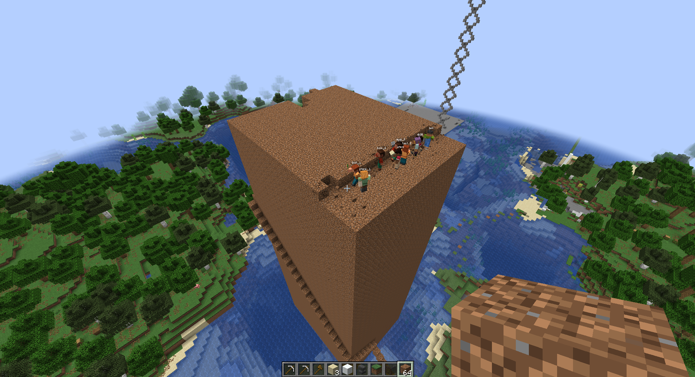
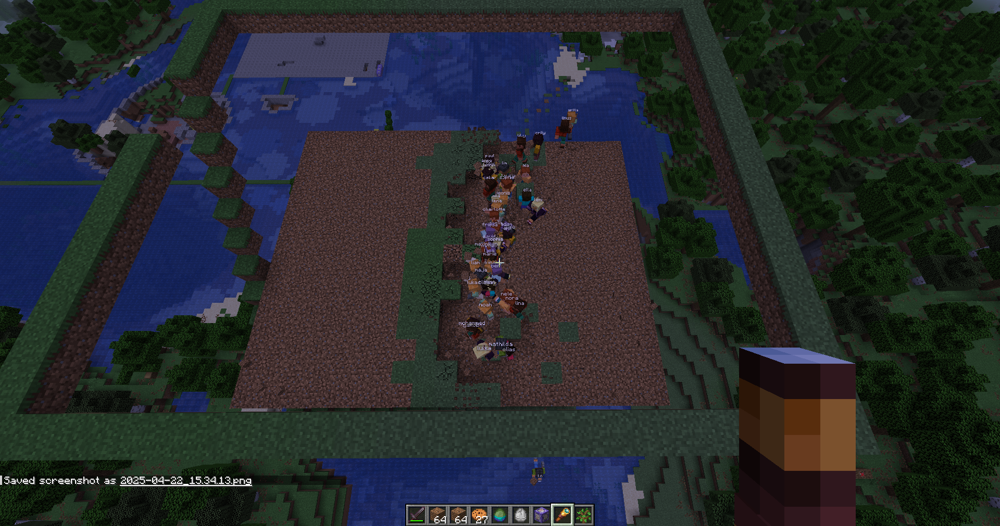
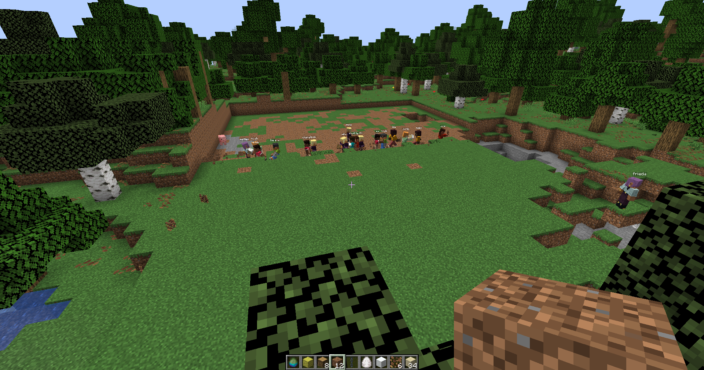

# `gang`

a minecraft bot swarm that:

1. do tasks
2. when anyone's attacked, everyone attacks back
3. can clear entire areas
4. if there's nothing else to do, follow their owner





made possible by rust and [azaela](https://github.com/azalea-rs/azalea)

## under the hood

under the hood there's a server that coordinates tasks and clients that request tasks and report certain events in the world

they use simple [tcp](honeypack/README.md) [packets](client_v2/src/tasks/net/mod.rs) to communicate with one another

since after like 20 or so bots in a single process all the bots would lag uncontrollably, have horrible ping and randomly disconnect, so multiple client processes are used

the server coordinates username generation, the clients are pretty much slaves to the server

## usage

uses rust nightly so use rustup to configure your toolchain appropriately

clone the repo

```bash
cargo run -p client_v2 --release master 3*5 your_mc_username
```

you can edit `3*5` to be anything you want, it's `number of clients per process` `*` `number of processes`

they'll join `localhost:25565` and start following you

in chat, you can use the following commands:

```chat
gang demolish <x> <y> <z> <to x> <to y> <to z>
gang stop
```
